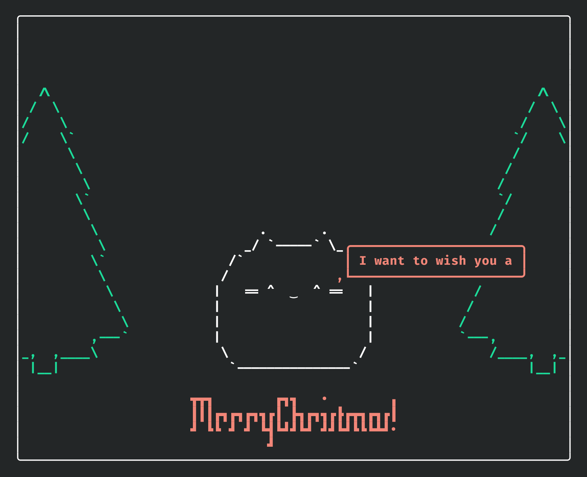

# Cat Christmas Animation

This is a short terminal based text animation featuring a cat which wishes you a merry christmas, written entirely in LispBM. This was created for [Joel Svensson's](https://github.com/svenssonjoel) **"LBM Christmas scripting challenge"** (which was a private thing).



## Running it

You can enter a complete environment for running it using `nix develop`, but if you don't have nix you can just manually ensure that you have **just** and the **LispBM** desktop repl **v0.28.1** installed. (The LispBM repl binary must be available on your path and be named "lbm"). Then run the animation by invoking
```shell
just play
```

Otherwise you can also simply run `lbm --src main.lisp --terminate --heap_size=262144 --memory_size=11 --eval="(play)"`.
